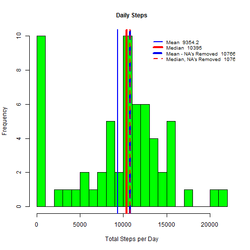
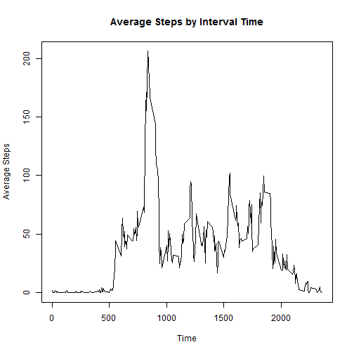
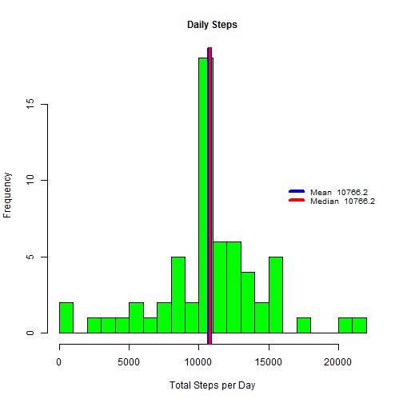

# Reproducible Research Project 1
*This assignment makes use of data from a personal activity monitoring device. This device collects data at 5 minute intervals through out the day. The data consists of two months of data from an anonymous individual collected during the months of October and November, 2012 and include the number of steps taken in 5 minute intervals each day.*

### Data Load and Preprocessing

```r
## Coursera Reproducible Research Beta Test New Course Format
## Project 1

## clear the workspace of any existing variables
rm(list=ls())
#######
## Adjust working directory as required and load libraries
wd <- "~/Coursera/ReproducibleResearch2/Project1"
if (getwd() != wd) {
    setwd(wd)  
}
library(data.table)
library(plyr)

## Get Data File
link <- "https://d396qusza40orc.cloudfront.net/repdata%2Fdata%2Factivity.zip"

if (!file.exists("activity.csv")){
    download.file(link, destfile = "activity.zip")
    unzip("activity.zip")
    dateDownloaded <- date()
}

## Acquire Data and format date column
#unzip("./repdata_data_activity.zip")
rawData <- data.table(read.table("activity.csv", header=T, sep=","))

rawData$date <- as.Date(as.character(rawData$date))


##### Total, Mean and Median Steps per day
# There are two ways of processing the data to obtain the median 
# and mean. Ignoring the data as per the assignment instructions:
ignoreData <- rawData[,.(total_steps = sum(na.omit(steps))), by = date]
ignoreMean <- round(mean(ignoreData$total_steps), digits = 1)
ignoreMedian <- round(median(ignoreData$total_steps), digits = 1)

# or eliminating the NA values, rather than treating them as a 
# count of 0 steps for that interval:
noNA_Data <- na.omit(rawData)
noNA_Data <- noNA_Data[, .(totalSteps = sum(steps)), by = date]
noNA_Mean <- round(mean(noNA_Data$totalSteps), digits = 1)
noNA_Median <- round(median(noNA_Data$totalSteps), digits = 1)
```
### What is the Mean Total number of steps taken per day?
Average Total steps are 

```r
ignoreMean
```

```
## [1] 9354.2
```

```r
noNA_Mean
```

```
## [1] 10766.2
```
while the Median total steps are

```r
ignoreMedian
```

```
## [1] 10395
```

```r
noNA_Median
```

```
## [1] 10765
```
# Generate Histogram

```r
hist(ignoreData$total_steps,
     xlab = "Total Steps per Day",
     main = "Daily Steps",
     col = "green",
     cex.main = 1.0,
     breaks = 30)

abline(v = ignoreMean,
       lwd = 2, 
       col = 'blue')

abline(v = ignoreMedian,
       lwd = 4, 
       col = "red")    

abline(v = noNA_Mean,
       lwd = 4,
       col = "blue2",
       lty = 2)

abline(v = noNA_Median,
       lwd = 2,
       col = "red2",
       lty = 2)
     
legend(13000,10, 
       legend = c(paste("Mean ", ignoreMean),
                  paste("Median ", ignoreMedian),
                  paste("Mean - NA's Removed ", noNA_Mean),
                  paste("Median, NA's Removed ", noNA_Median)
       ),
       lty = c(1,1,2,2),
       col = c("blue", "red", "blue2", "red2"),
       bty = "n",
       lwd = c(2, 4, 4, 2), 
       cex = .8
)
```

 

# Average Daily Activity Pattern with Max Interval Average

```r
ada_Pattern <- rawData[,.(ave_steps = mean(na.omit(steps))), by = interval]
plot(ada_Pattern,
     type="l",
     main = "Average Steps by Interval Time",
     xlab = "Time",
     ylab = "Average Steps"
     )
```

 
 
 The interval with the highest value of average steps is

```r
with(ada_Pattern, interval[ave_steps == max(ave_steps)])
```

```
## [1] 835
```
with

```r
with(ada_Pattern, ave_steps[interval == 835])
```

```
## [1] 206.1698
```
average steps.

# Missing Values
 There are a total of 

```r
missing_Data <- as.numeric(sum(is.na(rawData$steps)))
```
2304 missing (NA) values in the data.

# Create new data table by merging raw data with interval mean data.

```r
new_Data <- merge(rawData, ada_Pattern, "interval")
new_Data$steps[is.na(new_Data$steps)] <- new_Data$ave_steps[is.na(new_Data$steps)]

## Sort new_Data by date and interval time
new_Data <- arrange(new_Data, date, interval)
#new_Data <- data.table(new_Data)
new_ignoreData <- new_Data[,.(total_steps = sum(steps)), by = date]
new_ignoreMean <- round(mean(new_ignoreData$total_steps), digits = 1)
new_ignoreMedian <- round(median(new_ignoreData$total_steps), digits = 1)
```

# Plot new Step totals, Mean and Median

```r
hist(new_ignoreData$total_steps,
     xlab = "Total Steps per Day",
     main = "Daily Steps",
     col = "green",
     cex.main = 1.0,
     breaks = 30)

abline(v = new_ignoreMean,
       lwd = 6, 
       col = 'blue')

abline(v = new_ignoreMedian,
       lwd =3, 
       col = "red")    

legend("right", 
       bty = "n",
       lty = 1,
       lwd = 4, 
       col = c("blue", "red"),
       cex = .8, 
       legend = c(paste("Mean ", new_ignoreMean),
                  paste("Median ", new_ignoreMedian))
)
```

 
